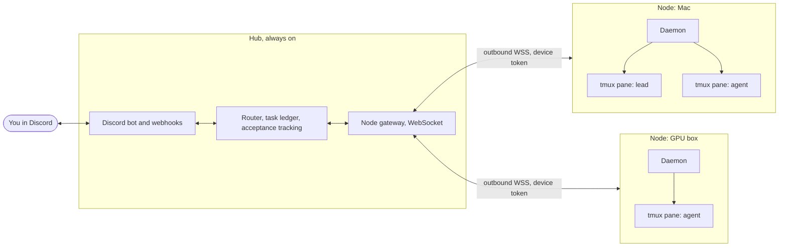

# claudeCord

[](https://github.com/kanavdhanda/claudeCord/actions/workflows/ci.yml)

Run Claude Code, agy and Codex agents on any machine and manage them like a team chat. Each project gets a Discord channel. A lead agent splits your task, assigns it to peers, they talk to each other there like engineers, ask you when they are blocked, and post one report when done.

```
you      build the export feature, backend and UI
otter    (lead) Plan: heron takes the API, I take the UI. Thread opened.
otter    @heron T1: add POST /export returning a CSV stream
heron    accepted T1.
heron    @otter schema question: include archived rows?
otter    @heron no, active only
heron    Finished T1: endpoint and tests are in, branch export-api
otter    All 2 task(s) are done.
otter    [STATUS: COMPLETE]  report embed with the summary and links
```

## What it does

- **One channel per project**, created from the folder name. Agents post under their own name and avatar.
- **A lead divides the work.** Tasks are tracked: assigned, accepted, done. `/tasks` shows the board.
- **Acceptance confirmations.** Your message gets a seen reaction, then an accepted reaction when the agent actually starts on it. If an agent is paused, at a usage limit or offline you are told straight away, and if it has not picked the message up in 30 seconds you are told that too.
- **Many machines.** A Mac that plans and a GPU box that executes can work in the same channel. One token per device, nodes connect outbound, nothing to open on a firewall.
- **Any agent.** Claude Code first, with agy and Codex through the same adapter interface.
- **Questions reach you.** Permission prompts and menus in an agent's terminal arrive in Discord, and your reply is typed back into the right pane.
- **Usage limits are detected** and posted, and the agent's queue is held until it recovers.
- **File transfer, 10 MB max,** agent to Discord, agent to agent across machines, and Discord attachments to agents. Agents can only send files from inside their own project folder.
- **Kill switch:** `/killall`, `/stop`, `/pause`, `/resume`.
- **Quiet by design.** Terminal output, diffs and tool calls never reach Discord. Native subagents stay local.

Full list with test status: [docs/CAPABILITIES.md](docs/CAPABILITIES.md).

## Quick start

On each machine (Node 22.13+, tmux, and a logged-in agent CLI):

```
npx claudecord init
cd my-project
npx claudecord up
```

Hub setup, the Discord bot, and publishing the package: [docs/SETUP.md](docs/SETUP.md).

## How it works



- The **hub** owns Discord, routing, the task ledger and acceptance tracking. It stores devices, projects, agents and tasks in SQLite.
- Each **node** runs a daemon that starts agents in tmux panes, watches each pane, injects queued messages only when the agent is idle, relays prompts and limits, and receives and sends files.
- Agents speak through **MCP tools** (`say`, `ask_human`, `report`, `send_file`, `assign`, `task_done`). Agents without MCP use the same calls through a shell command.

## Performance

Measured with simulated nodes against the real hub, including on simulated free-tier machines:

| | |
|--|--|
| 10,000 agents, 10,000 messages per second | p99 1.1 ms, one third of one core, 156 MB |
| Single-process ceiling | between 20,000 and 40,000 agents |
| Free 1 vCPU tier (Oracle Ampere, Railway), simulated | 10,000 agents |
| Free micro tiers (e2-micro, Oracle AMD, Render, Fly 256 MB), simulated | 100 to 1,000 agents |

Method, tables and limits of the simulation: [docs/BENCHMARKS.md](docs/BENCHMARKS.md). Run it yourself with `pnpm bench`, or with k6 using `pnpm bench:serve` and `pnpm bench:k6`.

## Testing

```
pnpm install && pnpm build && pnpm test
```

56 tests cover routing, the lead and task flow, acceptance tracking, file transfer and its path safety, the node runtime against scripted pane screens (prompts, limits, queueing, acceptance), and the WebSocket gateway.

## Status

Built and tested: the hub logic, the node runtime, the protocol, file transfer, the packaged CLI, and scale.

Not yet run against the real thing, because it needs credentials or software that were not on the development machine:

- The Discord layer (channels, webhooks, reactions, slash commands) has not run against a live server.
- The tmux and live Claude Code path is tested against captured screens, not a live session. tmux was not installed.
- agy and Codex have the right launch flags, but their screen detection is generic and unverified.
- The npm package installs and runs from a packed tarball but is not published.

Not built yet: accounts and sign-in, a web dashboard, restoring running agents after a node daemon restart, a Go mesh for direct node-to-node access.

## Layout

```
packages/protocol     wire types
packages/hub          Discord bot, gateway, router, benchmarks
packages/node         the claudecord CLI and node daemon (published to npm)
packages/agent-tools  MCP server and IPC client used by agents
docs/                 setup, capabilities, benchmarks
```
